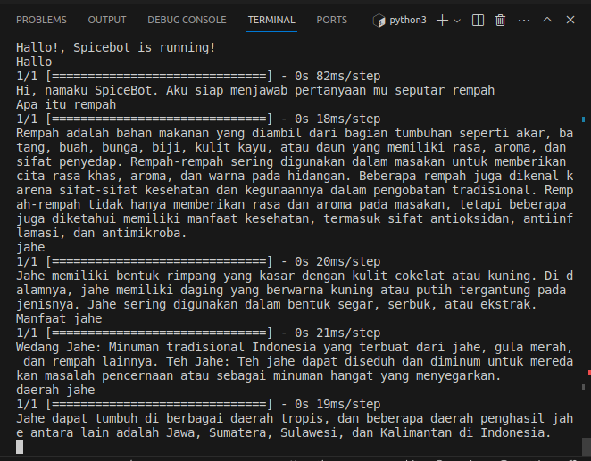

# SPICEFY MACHINE LEARNING PROJECT

# Team Profile
### Team ID : CH2-PS349
### Team Members
1. (ML) M124BSY1424 – Annur Riyadhus Solikhin – Politeknik Harapan Bersama
2. (ML) M124BSX1754 – Rakhmadhani Nurul Aini – Politeknik Harapan Bersama
3. (ML) M268BSY1922 – Robby Febrian Saputro – Universitas Muhammadiyah Surakarta
4. (CC) C015BSY3206 – Fatrah Ahmad Putra – Universitas Negeri Yogyakarta
5. (CC) C312BSY4359 – Sangaji Suryo Guritno – Universitas Sebelas Maret
6. (MD) A124BSY2879 – Nur Rizqi Maulana – Politeknik Harapan Bersama
7. (MD) A346BSY2626 – Akbar Maulana – Universitas Adhirajasa Reswara Sanjaya

# Machine Learning Project
### Spicefy Project Background
This spice detection app provides complete information about various types of spices in Indonesia. Using precision calculations based on spice image datasets, the app not only helps Generation Z accurately recognize spices, but also provides detailed information such as names, photos, and properties of spices. In addition, the app educates about the health benefits of spices and how to use them in healthy cooking. Through integration with online platforms, users can not only identify, but also buy or sell spices according to their needs, efficiently supporting the spice market ecosystem.
### Machine Learning
Building 2 models with TensorFlow, The first builds a spice classification model with efficientNetV2 with 25 types of spices, and the second builds a chatbot model using NLP that is equipped with various information about spices.

## Image Classification Model
### Tools & Library User
- Google Colab
- Tensorflow
- Numpy
- PIL
- Matplotlib

### Dataset
- [Dataset](https://drive.google.com/drive/folders/1eEb11nuckBn8Y7M5liYey9gyYz4pXYpE?usp=sharing)

### Training Result
Model reach 94% validation accuracy
 

### Prediction Test
Prediction test with cengkeh image

## Chatbot Model
In Chatbot-Model folder contains Python code for training and interacting with a simple chatbot using TensorFlow, Natural Language Toolkit (NLTK), and Keras.

### Files and Structure  
#### Training Code ([model_training.py](https://github.com/spicefyapp/machine-learning/blob/main/Chatbot-Model/model_training.py))
- [intents.json](https://github.com/spicefyapp/machine-learning/blob/main/Chatbot-Model/intents.json): JSON file containing conversation patterns and intent tags  
- [words.pkl](https://github.com/spicefyapp/machine-learning/blob/main/Chatbot-Model/words.pkl): Pickle file storing words generated from conversation patterns  
- [classes.pkl](https://github.com/spicefyapp/machine-learning/blob/main/Chatbot-Model/classes.pkl): Pickle file storing intent tags  
- [model_training.py](https://github.com/spicefyapp/machine-learning/blob/main/Chatbot-Model/model_training.py): Main code for training and saving the chatbot model  

#### Interaction Function Code ([chatbot.py](https://github.com/spicefyapp/machine-learning/blob/main/Chatbot-Model/chatbot.py))
- [intents.json](https://github.com/spicefyapp/machine-learning/blob/main/Chatbot-Model/intents.json): JSON file with conversation patterns and intent tags  
- [words.pkl](https://github.com/spicefyapp/machine-learning/blob/main/Chatbot-Model/words.pkl): Pickle file storing words generated from conversation patterns  
- [classes.pkl](https://github.com/spicefyapp/machine-learning/blob/main/Chatbot-Model/classes.pkl): Pickle file storing intent tags  
- [chatbot_model.h5](https://github.com/spicefyapp/machine-learning/blob/main/Chatbot-Model/chatbot_model.h5): Pre-trained chatbot model  
- [chatbot.py](https://github.com/spicefyapp/machine-learning/blob/main/Chatbot-Model/chatbot.py): Code for interacting with the trained chatbot model  

### Workflow
#### Training Code ([model_training.py](https://github.com/spicefyapp/machine-learning/blob/main/Chatbot-Model/model_training.py))

1. Prepare Training Data
   - Read and load data from a JSON file ([intents.json](https://github.com/spicefyapp/machine-learning/blob/main/Chatbot-Model/intents.json))
   - Perform tokenization using nltk.word_tokenize
   - Perform lemmatization to convert words into basic forms
   - Store unique words and categories in words and classes variables
2. Preprocessing Training Data
   - Form a data structure to store word patterns and categories (documents)
   - Create an ignoreLetters list for characters that are ignored
   - Create a training list to store training data in a format suitable for model training
3. Build Model
   - Use the TensorFlow library to build the Sequential model
   - Add Dense layers with ReLU activation function
   - Use softmax function on the output layer as it is a classification problem
4. Train Model
   - Use Adam's optimizer and categorical_crossentropy loss function
   - Set an accuracy metric for monitoring
5. Save Model
   - Train the model using training data (trainX and trainY) with batch size 5 and for 200 epochs and using callbacks
   - Save the model to the file 'chatbot_model.h5' after training
  
#### Interaction Function Code ([chatbot.py](https://github.com/spicefyapp/machine-learning/blob/main/Chatbot-Model/chatbot.py))

1. Load Model
   - The intents.json file is read to obtain a dataset containing question patterns and intent categories
   - The chatbot model (chatbot_model.h5) is loaded using Keras
2. Preprocessing User Input
   - The user provides input in the form of question text
   - The clean_up_sentence function is used to tokenize and lemmatize the user input
   - The bag_of_words function generates a bag-of-words vector representation of the input
3. predict_class()
   - The chatbot model is called upon to predict question categories based on the user input bag-of-words vector
   - A threshold is used to determine the categories that have a prediction probability above the threshold
4. get_response()
   - The predicted intent categories are used to search for random responses from the corresponding intents
   - This provides variety in the answers given by the chatbot
5. Output Response
   - A randomly selected answer is sent as a response to the user

### Training Result
Model reach 82% accuracy  

### Testing Interact with Chatbot
Trying input some question to chatbot  

### How to Use
#### Training the Chatbot Model
1. Ensure dependencies are installed by running pip install -r [requirements.txt](https://github.com/spicefyapp/machine-learning/blob/main/Chatbot-Model/requirements.txt)
2. Run [model_training.py](https://github.com/spicefyapp/machine-learning/blob/main/Chatbot-Model/model_training.py) to train the chatbot model
3. The trained model will be saved in the file [chatbot_model.h5](https://github.com/spicefyapp/machine-learning/blob/main/Chatbot-Model/chatbot_model.h5)

#### Interacting with the Chatbot
1. Run [chatbot.py](https://github.com/spicefyapp/machine-learning/blob/main/Chatbot-Model/chatbot.py) to interact with the pre-trained chatbot model
2. Input your messages, and the chatbot will respond based on its training  
